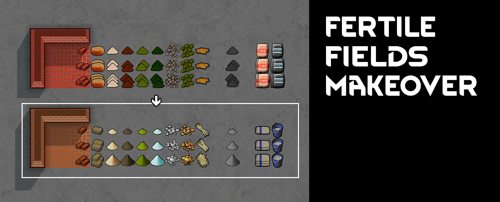

# FertileFieldsMakeover
A re-texture for Rainbeau's Fertile Fields, a RimWorld mod. 

[**>>> DOWNLOAD IT HERE <<<**](https://github.com/jptrrs/FertileFieldsMakeover/releases/latest)

Everybody loves <a href="https://steamcommunity.com/sharedfiles/filedetails/?id=1539311500">Rainbeau's Fertile Fields</a>... but only for what's inside! I thought it deserved better looks, so that's what I did. This is a recoloring and retexture of its resources. I didn't touch the buildings or the UI, tough, as it seems to me they fit well within the rest of the game.
Changes also extend to these other mods, if present: 

<ul>
<li> <a href="https://steamcommunity.com/sharedfiles/filedetails/?id=1539310322">Rainbeau's Concrete</a> (changed cement and concrete items)
</li><li> <a href="https://steamcommunity.com/sharedfiles/filedetails/?id=1833163132">Ceramics</a> (changed fired bricks color and textures. Now you can tell them apart from unfired bricks!)
</li><li> <a href="https://steamcommunity.com/sharedfiles/filedetails/?id=1602597619">Fertile Fields Dub's Hygiene Compat</a> (changes ash)
</li></ul>

Load after Fertile Fields.

